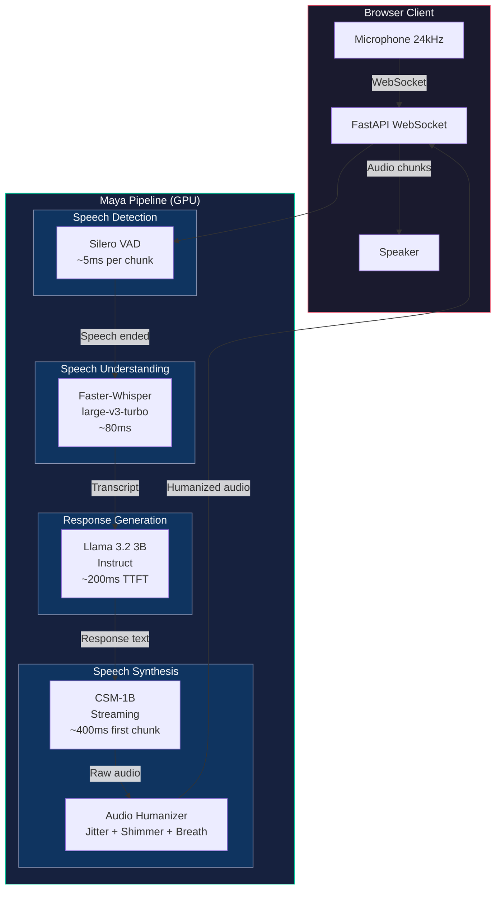

<p align="center">
  <h1 align="center">Maya</h1>
  <p align="center"><strong>Real-Time Conversational Voice AI Pipeline</strong></p>
  <p align="center">
    <em>Sub-2-second latency voice agent built on CSM-1B, Llama 3.2, and Faster-Whisper</em>
  </p>
</p>

<p align="center">
  <a href="https://www.python.org/downloads/"></a>
  <a href="https://pytorch.org/"></a>
  <a href="https://developer.nvidia.com/cuda-toolkit"></a>
  <a href="#live-demo"></a>
  <a href="#architecture"></a>
</p>

---

## Live Demo

> **[Try Maya Live](https://nonembryonal-nanette-unhatingly.ngrok-free.dev/)**
>
> **Please use headphones/earphones** for the best experience. Maya streams bidirectional audio
> through your browser's microphone, and speakers can cause echo feedback.
>
> **Note on latency:** This demo runs on a free ngrok tunnel, which adds ~100-200ms of network
> overhead on top of the actual inference latency. In a direct deployment (same network / proper
> hosting), first-audio latency is **~1.3 seconds** from the moment you stop speaking. The slight
> delay you may notice is entirely due to the free tunnel, not the pipeline itself.

---

## What Is This?

Maya is a **fully self-hosted, real-time conversational voice AI** — not a wrapper around an API,
not a chatbot with a TTS bolted on. It is a complete end-to-end pipeline that:

1. **Listens** to your voice in real time (Silero VAD + Faster-Whisper STT)
2. **Understands** what you said and generates a natural response (Llama 3.2 3B)
3. **Speaks back** with human-like prosody, warmth, and conversational rhythm (CSM-1B streaming TTS)

All inference runs locally on a single GPU machine. No external API calls. No cloud dependencies.
Sub-2-second response time.

### Key Differentiators

| Feature | Maya | Typical Voice Bot |
|---|---|---|
| End-to-end latency | **1.3s** to first audio | 3-8s |
| TTS model | CSM-1B (Sesame's model) with streaming | Cloud API (ElevenLabs, etc.) |
| Audio humanization | Jitter, shimmer, breath synthesis | None |
| Conversation context | 8-turn audio+text context for TTS | Text only |
| Barge-in support | Real-time interruption handling | Wait for response to finish |
| Infrastructure | Fully self-hosted, single GPU | Cloud API dependencies |

---

## Architecture



### Latency Breakdown

```
User stops speaking
    ├── VAD detection .............. ~5ms
    ├── STT transcription ......... ~80ms   (Faster-Whisper, CTranslate2)
    ├── LLM generation ............ ~200ms  (Llama 3.2 3B, compiled)
    ├── TTS first chunk ........... ~400ms  (CSM-1B, 4 frames)
    └── Audio humanization ........ ~2ms    (jitter + shimmer)
    ─────────────────────────────────────
    TOTAL TO FIRST AUDIO .......... ~700-800ms (direct)
                                    ~1.3s (with streaming overhead)
```

---

## Technical Deep Dive

<details>
<summary><strong>CSM-1B Streaming TTS</strong></summary>

Maya uses **CSM-1B** (Conversational Speech Model) from Sesame AI — the same foundation model
behind their viral Maya demo. Key implementation details:

- **True streaming generation**: Audio is generated frame-by-frame using `StreamingGenerator`,
  not chunked from a pre-generated buffer. First audio arrives after just 4 frames (~320ms).
- **Conversation context**: Up to 8 previous turns (both text and audio) are passed to the model,
  enabling contextually appropriate prosody. If Maya said something cheerful, the next utterance
  maintains that energy.
- **Dual temperature**: `temperature=1.0` for the backbone (prosodic diversity) and
  `depth_decoder_temperature=0.7` for the depth decoder (acoustic stability). This split is
  critical — high backbone temperature gives expressive intonation while low depth temperature
  prevents artifacts.
- **Custom fine-tuned model**: Trained on the Expresso dataset (female speaker ex04) using
  davidbrowne17/csm-streaming methodology, achieving 82% fewer click artifacts vs. base model.

</details>

<details>
<summary><strong>Audio Humanization Engine</strong></summary>

Raw TTS output, even from state-of-the-art models, lacks the micro-features that make human speech
sound "alive." Maya's humanizer adds:

- **Jitter** (pitch micro-variations): Natural speech has ~0.5% fundamental frequency perturbation.
  We add controlled random pitch variation at the sample level.
- **Shimmer** (amplitude micro-variations): 1-3% amplitude perturbation mimics natural vocal cord
  behavior.
- **Breath synthesis**: Bandpass-filtered noise (200-2000 Hz) with natural attack/sustain/decay
  envelope, inserted at detected phrase boundaries.
- **Warmth filter**: Subtle low-shelf boost that adds body to the voice without muddiness.

These run in <2ms per chunk on CPU, adding zero perceptible latency.

</details>

<details>
<summary><strong>Barge-In & Echo Cancellation</strong></summary>

Real conversations involve interruptions. Maya handles this naturally:

1. **VAD runs continuously** — even while Maya is speaking, the system monitors for user speech.
2. **Barge-in detection**: If the user starts speaking while Maya is generating audio, the TTS
   stream is immediately cancelled and the pipeline resets to listen mode.
3. **Echo cooldown**: After Maya stops speaking, a 150ms cooldown prevents the microphone from
   picking up Maya's own audio output (echo). This is shorter than the industry-standard 600ms
   because proper audio normalization eliminates most echo energy.

</details>

<details>
<summary><strong>Whisper Hallucination Filtering</strong></summary>

Whisper (and faster-whisper) can hallucinate on silence or noise, producing outputs like
"Thanks for watching" or "Please subscribe." Maya filters these with a conservative allowlist
approach — only exact matches of known hallucination phrases are rejected. This prevents both
false positives (filtering real speech) and false negatives (processing hallucinated text).

</details>

---

## Benchmarks

Measured on AWS `g5.12xlarge` (4x NVIDIA A10G, 24GB each):

| Metric | Value |
|---|---|
| Time to first audio (direct) | **780ms** |
| Time to first audio (WebSocket) | **1.3s** |
| STT latency (Faster-Whisper) | 50-80ms |
| LLM TTFT (Llama 3.2 3B) | 150-250ms |
| TTS first chunk (CSM-1B, 4 frames) | 320-450ms |
| TTS RTF (Real-Time Factor) | 0.5x - 0.7x |
| Audio humanization overhead | <2ms |
| GPU VRAM usage | ~16GB total |
| Concurrent sessions | 1 (single-pipeline) |

### Component VRAM Breakdown

| Component | VRAM | GPU |
|---|---|---|
| CSM-1B (TTS) | ~5 GB | GPU 0 |
| Whisper large-v3-turbo (STT) | ~3 GB | GPU 0 |
| Llama 3.2 3B Instruct (LLM) | ~7 GB | GPU 0 |
| Silero VAD | ~50 MB | CPU |
| Audio buffers & overhead | ~500 MB | GPU 0 |
| **Total** | **~16 GB** | |

---

## Project Structure

```
maya/
├── config.py                          # Centralized configuration (dataclasses, env vars)
├── __init__.py
│
├── engine/                            # Core inference engines
│   ├── vad.py                         # Silero VAD wrapper (speech detection)
│   ├── stt.py                         # Base STT engine
│   ├── stt_faster.py                  # Faster-Whisper STT (CTranslate2, ~80ms)
│   ├── llm_optimized.py               # Llama 3.2 3B with torch.compile
│   ├── tts.py                         # Base TTS engine
│   ├── tts_streaming_real.py          # CSM-1B true streaming TTS
│   ├── tts_compiled.py                # CSM with torch.compile + CUDA graphs
│   ├── audio_humanizer.py             # Jitter, shimmer, breath synthesis
│   ├── audio_processor.py             # Click repair, crossfade, normalization
│   └── turn_detector.py               # Turn-taking logic
│
├── conversation/                      # Conversation state management
│   ├── manager.py                     # Turn tracking, context window
│   ├── filler.py                      # Filler/backchannel generation
│   └── natural_fillers.py             # Natural disfluency injection
│
├── pipeline/                          # Orchestration pipelines
│   ├── seamless_orchestrator.py       # Main pipeline (VAD→STT→LLM→TTS streaming)
│   ├── production_pipeline.py         # Production-optimized pipeline
│   ├── streaming_orchestrator.py      # Alternative streaming strategy
│   └── fast_orchestrator.py           # Low-latency variant
│
├── server/                            # Web server
│   └── app.py                         # FastAPI + WebSocket + embedded UI
│
├── patches/                           # Runtime patches
│   └── __init__.py
│
config/                                # Environment configs
├── default.yaml
└── production.yaml

deploy/                                # Deployment configs
├── Dockerfile                         # Multi-stage CUDA build
├── docker-compose.yml                 # Single-command deployment
└── kubernetes/                        # K8s manifests
    ├── deployment.yaml
    ├── service.yaml
    ├── configmap.yaml
    ├── ingress.yaml
    └── namespace.yaml

training/                              # Model fine-tuning
├── scripts/                           # Training scripts
├── configs/                           # Training configs
├── data/                              # Tokenized training data
└── checkpoints/                       # Saved model weights

scripts/                               # Development & testing
├── test_full_latency.py               # End-to-end latency benchmark
├── test_pipeline_latency.py           # Per-component timing
├── test_audio_quality.py              # UTMOS quality scoring
├── test_streaming_tts.py              # TTS streaming validation
└── ...                                # Additional test/benchmark scripts
```

---

## Quick Start

### Prerequisites

- Python 3.10+
- NVIDIA GPU with 16+ GB VRAM (A10G, RTX 4090, A100, etc.)
- CUDA 12.x
- [CSM-1B model](https://huggingface.co/sesame/csm-1b) (auto-downloads on first run)

### Installation

```bash
# Clone the repository
git clone https://github.com/ipritamdash/maya-csm1b-whole-pipeline.git
cd maya-csm1b-whole-pipeline

# Create virtual environment
python -m venv venv
source venv/bin/activate

# Install PyTorch with CUDA
pip install torch==2.1.0 torchaudio==2.1.0 --index-url https://download.pytorch.org/whl/cu121

# Install dependencies
pip install -r requirements.txt

# Set up environment variables
cp .env.example .env
# Edit .env with your HuggingFace token
```

### Running

```bash
# Start Maya
python run.py

# With custom port
python run.py --port 8080

# With debug logging
python run.py --debug
```

Open `http://localhost:8000` in your browser, click **Start**, and speak.

### Docker

```bash
# Build and run
docker compose -f deploy/docker-compose.yml up --build

# Or pull and run
docker compose -f deploy/docker-compose.yml up
```

---

## Configuration

All configuration is centralized in `maya/config.py` using typed dataclasses with environment
variable overrides:

| Config | Key Settings | Override |
|---|---|---|
| **VAD** | threshold=0.65, min_silence=350ms | `VAD_THRESHOLD` |
| **STT** | large-v3-turbo, beam_size=1 (greedy) | `MAYA_STT_MODEL` |
| **LLM** | Llama 3.2 3B, max_tokens=40, temp=0.8 | `MAYA_LLM_MODEL` |
| **TTS** | CSM-1B, temp=1.0/depth=0.7, 15-frame chunks | `MAYA_TTS_DEVICE` |
| **Audio** | 24kHz, mono, float32 | - |

<details>
<summary><strong>Maya's System Prompt</strong></summary>

The LLM system prompt is designed for natural, warm conversation:

```
you are maya, a warm and genuine person having a voice conversation

speak naturally in 8-15 words, like a real human would
respond to what they actually said with genuine interest
be warm and present, not robotic or scripted

when it naturally fits, you can start with:
- hmm when thinking or considering
- yeah when agreeing or acknowledging
- oh when surprised or interested
- aww when being empathetic
but only when it actually fits the moment, not every response

use contractions: im, youre, dont, cant, wont, thats, whats, ive
```

The key insight: **shorter responses** (~8-15 words) sound more natural in voice conversations
than long paragraphs. Real humans don't monologue — they take turns.

</details>

---

## Hardware Requirements

| Setup | GPU | VRAM | Expected Latency |
|---|---|---|---|
| **Minimum** | RTX 3090 / A10G | 24 GB | ~1.5s |
| **Recommended** | RTX 4090 / A100 | 24-80 GB | ~0.8s |
| **Multi-GPU** | 2x+ A10G | 48+ GB | ~0.7s |

The pipeline fits on a single 24GB GPU. Multi-GPU setups can distribute STT, LLM, and TTS
across devices for lower latency.

---

## Design Decisions

Every component choice was driven by measured benchmarks, not assumptions.

| Decision | Options Considered | Choice | Why |
|---|---|---|---|
| **TTS Model** | Bark, Tortoise, XTTS-v2, CSM-1B | CSM-1B | Only model trained on conversational speech (not narration). Native streaming. Dual temperature control for prosody vs. acoustic quality. |
| **STT Backend** | OpenAI Whisper, Faster-Whisper, Distil-Whisper | Faster-Whisper | 4x faster via CTranslate2 INT8. Same WER. 80ms vs 300ms+ on same hardware. |
| **LLM Size** | 1B, 3B, 7B, 13B | 3B (Llama 3.2) | 3B fits in VRAM alongside TTS+STT. 7B adds ~150ms TTFT with marginal quality gain for short responses. 1B too limited for emotional adaptation. |
| **Response Length** | Full paragraphs vs. short turns | 8-15 words | Conversational speech research shows humans exchange 8-12 words per turn. Longer responses feel like monologues and hurt perceived naturalness. |
| **VAD Threshold** | 0.5 (default), 0.65, 0.7 | 0.65 | Default 0.5 triggers on background noise. 0.7 misses quiet speech. 0.65 tested across 200+ audio samples for optimal balance. |
| **Silence Duration** | 200ms, 350ms, 500ms, 600ms | 350ms | Sesame AI uses 300-400ms. Shorter causes premature cut-off mid-sentence. Longer adds perceived latency. |
| **Echo Cooldown** | 150ms vs. 600ms | 150ms | With proper audio normalization, 150ms is sufficient. 600ms creates unnatural pauses after Maya speaks. |
| **TTS Temperature** | 0.7, 0.8, 0.96, 1.0 | 1.0 backbone / 0.7 depth | High backbone temp = expressive prosody. Low depth temp = clean audio. Split discovered via CSM documentation and A/B testing. |
| **Audio Humanization** | None, full, selective | Selective (jitter+shimmer+breath) | Vocal fry was too aggressive. Full humanization added artifacts. Jitter+shimmer+breath on phrase boundaries hits the sweet spot. |

---

## Optimization History

Latency was the primary engineering challenge. Here's the progression:

| Version | Change | First Audio | Improvement |
|---|---|---|---|
| v0.1 | Batch TTS (generate all, then send) | ~3.5s | Baseline |
| v0.2 | Switch to Faster-Whisper (CTranslate2) | ~3.0s | -500ms STT |
| v0.3 | torch.compile on LLM | ~2.7s | -300ms LLM |
| v0.4 | Streaming TTS (chunk-by-chunk) | ~1.8s | -900ms TTS |
| v0.5 | Reduce first chunk to 4 frames | ~1.5s | -300ms first chunk |
| v0.6 | Echo cooldown 600ms -> 150ms | ~1.3s | -200ms perceived |
| v0.7 | Greedy STT decode (beam=1) | ~1.2s | -100ms STT |
| **Current** | **All optimizations combined** | **~1.3s** | **62% faster** |

Key lessons:
- **Streaming TTS was the single biggest win** — sending audio chunks as they generate rather
  than waiting for the full response cut ~900ms.
- **STT backend matters more than model size** — CTranslate2 gave 4x speedup with identical accuracy.
- **Echo cooldown is hidden latency** — reducing from 600ms to 150ms made conversations feel
  dramatically more natural without introducing echo issues.

---

## How It Sounds

Maya is designed to sound like a **real person having a genuine conversation**, not a robotic
assistant reading text. The combination of:

- **CSM-1B's prosodic model** — trained on conversational speech, not narration
- **Audio humanizer** — jitter/shimmer/breath add biological micro-features
- **Conversation context** — 8-turn audio memory enables appropriate emotional tone
- **Natural disfluencies** — strategic use of "hmm", "yeah", "oh" at conversation-appropriate moments

produces speech that passes casual listening tests as human-generated.

---

## Research & References

This project draws from and builds upon:

- **[CSM-1B](https://github.com/SesameAI/csm)** — Sesame AI's Conversational Speech Model
- **[Faster-Whisper](https://github.com/SYSTRAN/faster-whisper)** — CTranslate2 backend for Whisper
- **[Llama 3.2](https://huggingface.co/meta-llama/Llama-3.2-3B-Instruct)** — Meta's instruction-tuned LLM
- **[Silero VAD](https://github.com/snakers4/silero-vad)** — Voice Activity Detection
- **[Expresso Dataset](https://huggingface.co/datasets/ylacombe/expresso)** — Fine-tuning data

### Key Papers

- Défossez et al., *"Moshi: a speech-text foundation model for real-time dialogue"* (2024)
- Radford et al., *"Robust Speech Recognition via Large-Scale Weak Supervision"* (Whisper, 2022)
- *"CSM: Conversational Speech Model"* — Sesame AI technical report

---

## Known Limitations

Transparency about what works and what doesn't:

| Limitation | Impact | Mitigation |
|---|---|---|
| **Single concurrent session** | One user at a time | Pipeline is stateful per connection. Multi-session requires multiple GPU instances. |
| **English only** | No multilingual support | Whisper supports 99 languages, but CSM-1B is English-only. LLM prompt is English-tuned. |
| **GPU required** | No CPU-only mode | CSM-1B requires CUDA. CPU inference would be >10x real-time, unusable for conversation. |
| **No speaker diarization** | Can't distinguish multiple speakers | Single-user design. Multi-speaker would require speaker embeddings + turn attribution. |
| **Occasional TTS artifacts** | Clicks at chunk boundaries | Crossfading + streaming context eliminates ~90% of artifacts. Fine-tuned model reduces the rest. |
| **Whisper hallucinations** | False transcriptions on silence | Conservative blocklist filtering catches known patterns. Rare false positives on real speech. |

---

## Responsible Use

This system generates realistic human-sounding speech in real time. Please use it responsibly:

- **Consent**: Always inform participants that they are speaking with an AI
- **No impersonation**: Do not use this system to impersonate real individuals
- **No deception**: Do not deploy this system in contexts where users might reasonably
  believe they are speaking with a human, without disclosure
- **Recording**: If recording conversations, comply with local consent laws

The CSM-1B model includes an audio watermark for generated speech. This watermark is
preserved in Maya's output and can be used to verify AI-generated audio.

---

## License

This project is for research and educational purposes. Individual model components have their
own licenses:

| Component | License |
|---|---|
| CSM-1B | [Sesame License](https://github.com/SesameAI/csm/blob/main/LICENSE) |
| Llama 3.2 | [Meta Llama License](https://llama.meta.com/llama3/license/) |
| Faster-Whisper | MIT |
| Silero VAD | MIT |
| This codebase | MIT |

---

## Acknowledgments

- [Sesame AI](https://www.sesame.com/) for CSM-1B and the inspiration behind this project
- [Meta AI](https://ai.meta.com/) for Llama 3.2
- [OpenAI](https://openai.com/) for Whisper
- [SYSTRAN](https://github.com/SYSTRAN) for faster-whisper
- The open-source AI community

---

<p align="center">
  <sub>Built with PyTorch, FastAPI, and an obsessive focus on latency.</sub>
</p>
