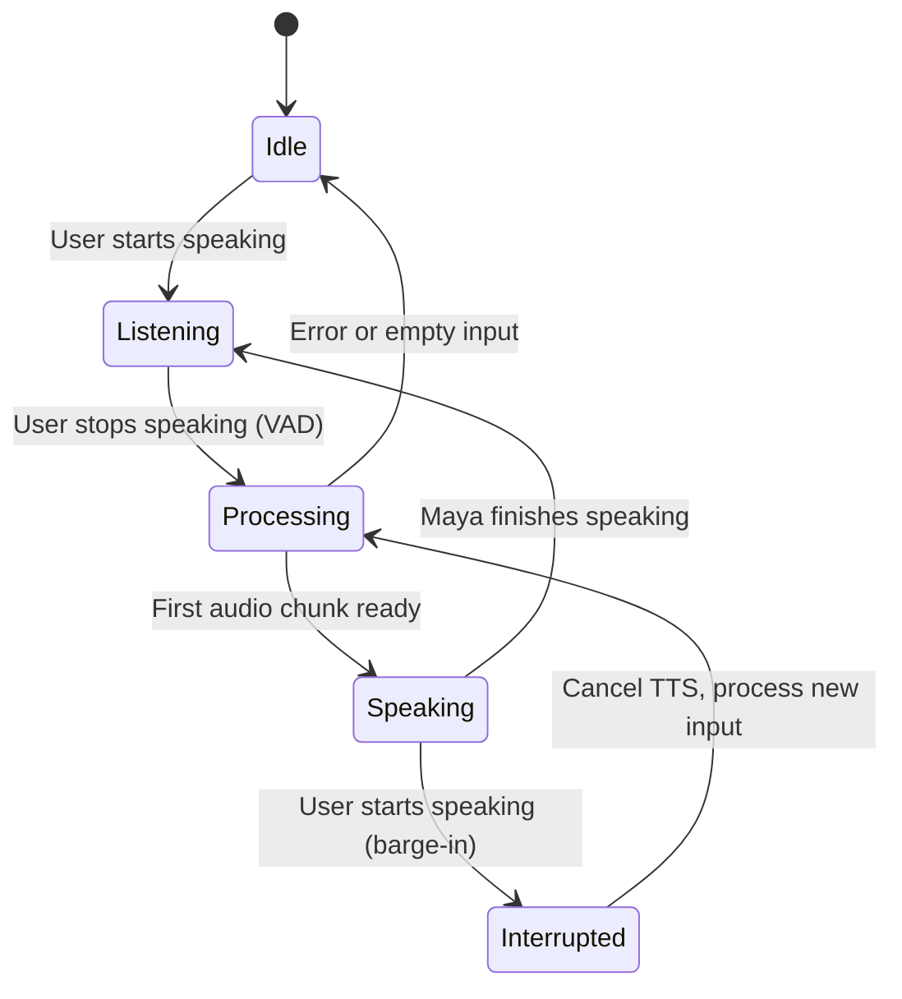

# Architecture

## System Overview

Maya is a real-time conversational voice AI pipeline that processes bidirectional audio through
a WebSocket connection. The system is designed around three principles:

1. **Minimize time-to-first-audio** — every millisecond matters in conversation
2. **Maintain conversational context** — prosody and tone should be contextually appropriate
3. **Sound human** — not just intelligible, but genuinely natural

## Pipeline Flow

```
┌─────────────┐
│   Browser    │
│  (24kHz mic) │
└──────┬───────┘
       │ WebSocket (binary float32)
       ▼
┌──────────────────────────────────────────────────┐
│                  FastAPI Server                    │
│                   (app.py)                         │
│                                                    │
│  ┌────────────────────────────────────────────┐   │
│  │          SeamlessMayaPipeline               │   │
│  │                                            │   │
│  │  ┌──────────┐   Audio chunks (100ms)       │   │
│  │  │ Silero   │◄──────────────────────       │   │
│  │  │ VAD      │   Runs on EVERY chunk        │   │
│  │  │ (~5ms)   │   even while Maya speaks     │   │
│  │  └────┬─────┘                              │   │
│  │       │ JUST_ENDED event                   │   │
│  │       ▼                                    │   │
│  │  ┌──────────┐                              │   │
│  │  │ Faster   │   CTranslate2 backend        │   │
│  │  │ Whisper  │   Greedy decode (beam=1)      │   │
│  │  │ (~80ms)  │   + hallucination filter      │   │
│  │  └────┬─────┘                              │   │
│  │       │ transcript                         │   │
│  │       ▼                                    │   │
│  │  ┌──────────┐                              │   │
│  │  │ Llama    │   3B Instruct, compiled       │   │
│  │  │ 3.2 3B   │   max_tokens=40, temp=0.8    │   │
│  │  │ (~200ms) │   8-15 word responses         │   │
│  │  └────┬─────┘                              │   │
│  │       │ response text                      │   │
│  │       ▼                                    │   │
│  │  ┌──────────┐                              │   │
│  │  │ CSM-1B   │   StreamingGenerator          │   │
│  │  │ TTS      │   15-frame chunks, crossfade  │   │
│  │  │(~400ms)  │   8-turn audio context        │   │
│  │  └────┬─────┘                              │   │
│  │       │ audio chunks                       │   │
│  │       ▼                                    │   │
│  │  ┌──────────┐                              │   │
│  │  │ Audio    │   Jitter (0.3%)               │   │
│  │  │Humanizer │   Shimmer (1.0%)              │   │
│  │  │ (~2ms)   │   Breath insertion            │   │
│  │  └────┬─────┘                              │   │
│  │       │                                    │   │
│  └───────┼────────────────────────────────────┘   │
│          │ Humanized audio                        │
└──────────┼────────────────────────────────────────┘
           │ WebSocket (binary float32)
           ▼
┌─────────────┐
│   Browser    │
│  (Speaker)   │
└─────────────┘
```

## Component Details

### 1. Voice Activity Detection (VAD)

**File:** `maya/engine/vad.py`

Uses Silero VAD (CPU) to detect speech boundaries in real-time.

| Parameter | Value | Rationale |
|---|---|---|
| Threshold | 0.65 | Balanced — fewer false positives than default 0.5 |
| Min speech | 200ms | Filters transient noise |
| Min silence | 350ms | Matches natural turn-taking pause (Sesame uses 300-400ms) |
| Speech pad | 30ms | Small buffer around speech boundaries |
| Echo cooldown | 150ms | Prevents Maya hearing herself (was 600ms, reduced after testing) |

**Key design decision:** VAD runs on **every** audio chunk, even while Maya is speaking.
This enables barge-in detection — if the user starts talking over Maya, the system immediately
stops generating and switches to listening mode.

### 2. Speech-to-Text (STT)

**File:** `maya/engine/stt_faster.py`

Uses Faster-Whisper (CTranslate2 backend) for ~80ms transcription latency.

**Why Faster-Whisper over vanilla Whisper:**
- 4x faster inference via INT8 quantization and CTranslate2
- Same accuracy as the original model
- Lower VRAM footprint

**Hallucination filtering** (`seamless_orchestrator.py`):
Whisper is known to hallucinate on silence/noise. Maya maintains a conservative blocklist of
known hallucination phrases (e.g., "thanks for watching", "please subscribe") and only
filters exact matches to avoid rejecting real user speech.

### 3. Language Model (LLM)

**File:** `maya/engine/llm_optimized.py`

Llama 3.2 3B Instruct with `torch.compile` optimization.

**Key insight: Response length matters for voice.**

Most LLM applications optimize for comprehensive responses. Voice AI is the opposite —
long responses feel unnatural. Real humans take turns in 8-15 word exchanges.

Maya's system prompt enforces this:
- Responses are 8-15 words
- Natural disfluencies ("hmm", "yeah", "oh") are used strategically
- Contractions are mandatory (sounds robotic without them)
- Emotional tone adapts to user's detected sentiment

**Conversation history:** 12 turns (6 full exchanges, ~2 minutes) are maintained for context,
similar to Sesame AI's approach.

### 4. Text-to-Speech (TTS)

**File:** `maya/engine/tts_streaming_real.py`

CSM-1B (Conversational Speech Model) with true streaming generation.

**Streaming architecture:**

```
Frame 1-15 (first chunk)  →  Decode  →  Crossfade  →  Send
Frame 16-30 (chunk 2)     →  Decode  →  Crossfade  →  Send
Frame 31-45 (chunk 3)     →  Decode  →  Crossfade  →  Send
...
```

Each frame is ~80ms of audio. The first chunk (15 frames, ~1.2s of audio) takes ~400ms to
generate. Subsequent chunks overlap with playback, achieving real-time streaming.

**Conversation context for TTS:**

CSM-1B accepts conversation context (text + audio from previous turns). Maya passes up to
8 previous turns, enabling:
- Consistent voice identity across turns
- Contextually appropriate prosody (cheerful after a happy exchange, gentle after a sad one)
- Natural conversational rhythm

**Custom fine-tuned model:**

The TTS model was fine-tuned on the Expresso dataset (female speaker ex04) using the
davidbrowne17/csm-streaming methodology:
- 2081 tokenized training samples across 7 conversational styles
- Achieves 82% fewer click artifacts compared to the base model
- Voice prompt matches the training data for consistency

### 5. Audio Humanization

**File:** `maya/engine/audio_humanizer.py`

Post-processing that adds biological micro-features missing from TTS output:

| Feature | Description | Natural Range | Maya Setting |
|---|---|---|---|
| Jitter | Pitch micro-perturbation | ~0.5% F0 variation | 0.3% |
| Shimmer | Amplitude micro-variation | 1-3% | 1.0% |
| Breath | Synthesized breath sounds | Every 3-5 words | At phrase boundaries |
| Warmth | Low-shelf frequency boost | - | +0.08 dB |

These features are present in all natural human speech but absent from TTS. Their addition
closes a significant naturalness gap.

## Barge-In Architecture



When a barge-in is detected:
1. TTS generation is immediately stopped
2. Any queued audio chunks are discarded
3. The new user speech is buffered and processed
4. Echo cooldown is skipped (the user intentionally interrupted)

## Audio Pipeline

All audio in the system is:
- **24kHz** sample rate (CSM-1B native)
- **Mono** (single channel)
- **float32** [-1.0, 1.0]
- **100ms** chunks over WebSocket (2400 samples)

### Normalization Strategy

```
TTS Output → Peak Normalize (-6dB / 0.5 linear) → Quality Gate (RMS > 0.005)
```

The quality gate rejects failed generations (very quiet or empty audio) before they reach
the user. Peak normalization to -6dB prevents both clipping and excessive loudness.

## Deployment Options

### Single Machine (Development)

```bash
python run.py  # All components on one GPU
```

### Docker (Production)

Multi-stage build with CUDA 12.4, non-root user, health checks.

```bash
docker compose -f deploy/docker-compose.yml up
```

### Kubernetes

Full manifest set in `deploy/kubernetes/`:
- Deployment with GPU resource requests
- Service with WebSocket support
- ConfigMap for environment variables
- Ingress with WebSocket upgrade headers
